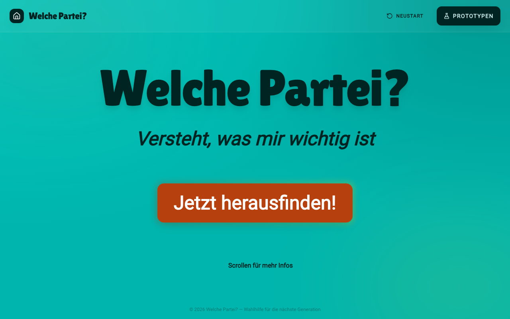
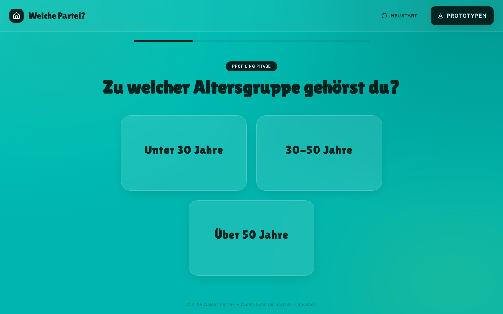
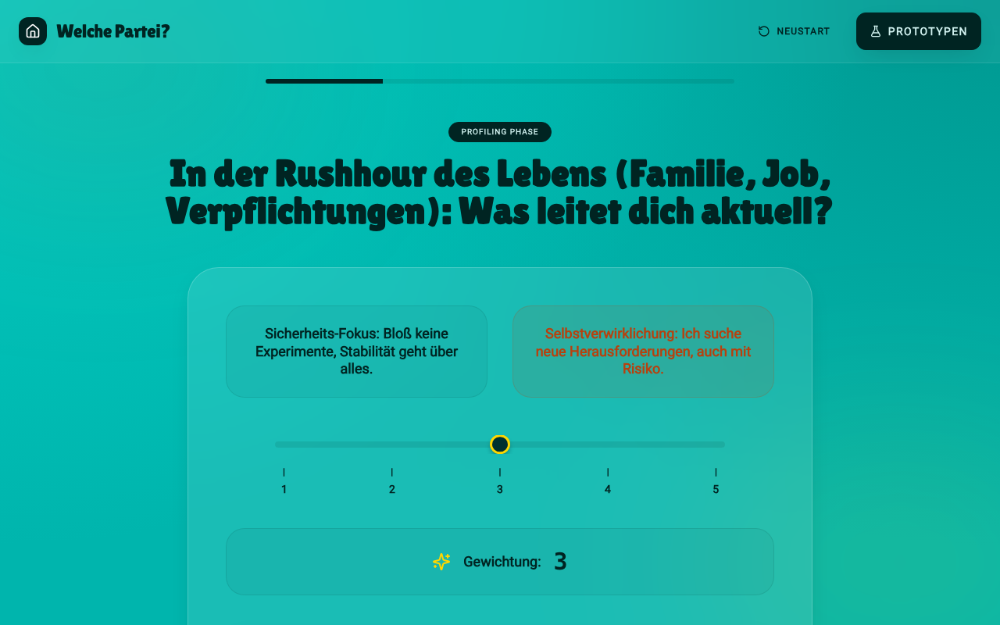
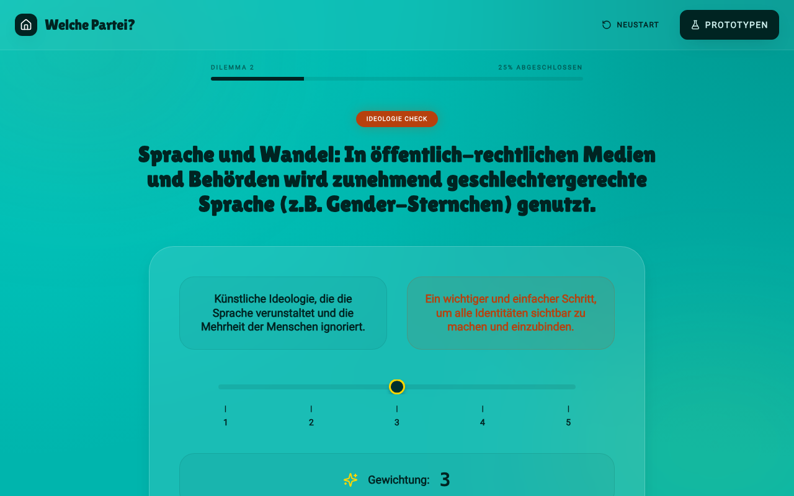
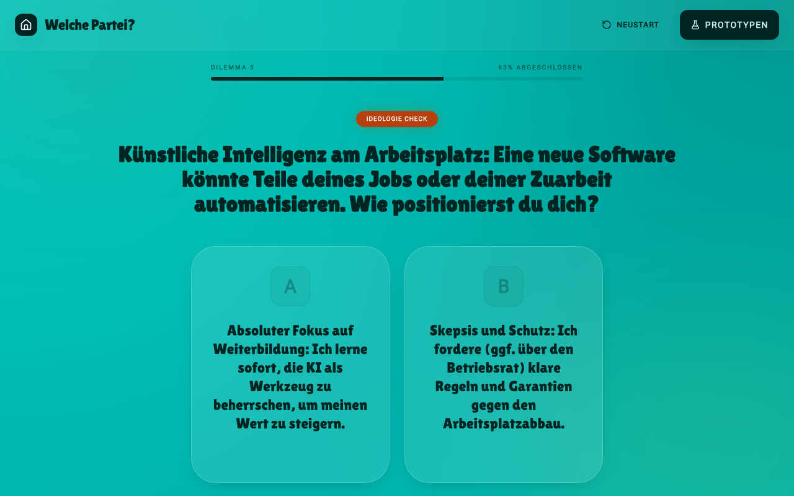
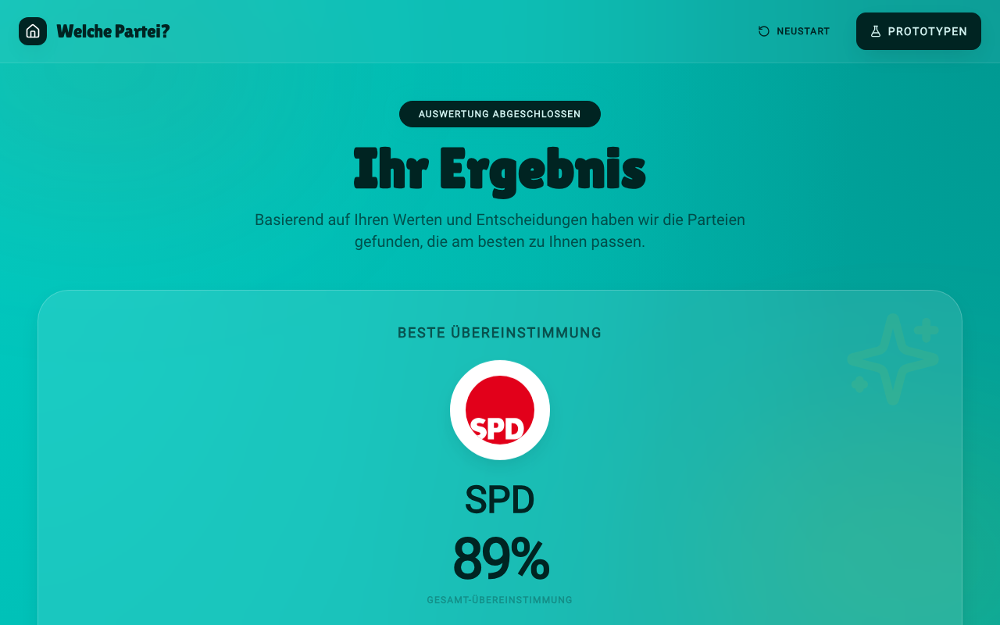
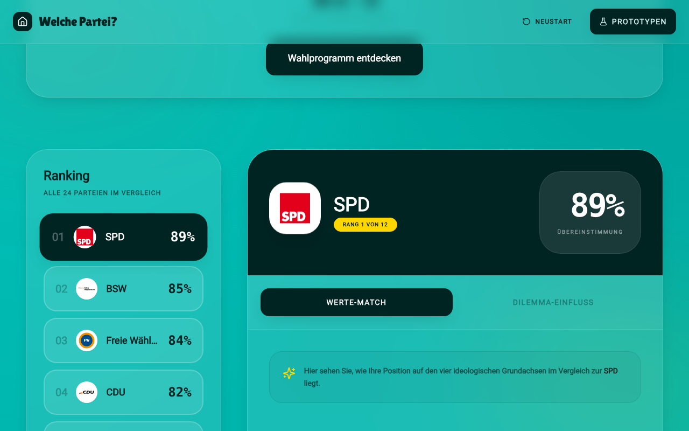

# Welche Partei?

Wahlhilfe-Prototyp für die nächste Bundestagswahl: Ein Quiz aus Profiling-Fragen und politischen Dilemmata ordnet Nutzer:innen einer Partei zu und zeigt, wie nah die Positionen beieinander liegen.

> ## ⚠️ Projekt verworfen
>
> **Dieses Projekt wird nicht weiterentwickelt.** Die Anwendung war nicht in der Lage, qualitativ belastbare Ergebnisse zu liefern: Die Zuordnung zu Parteien beruht auf stark vereinfachten Ideologie-Achsen, handgepflegten Parteigewichten und generierten Fragen/Texten, die einer fachlichen Prüfung nicht standhalten. Die angezeigten Übereinstimmungen (z. B. „89 % SPD“) sind **nicht als Wahlempfehlung zu verstehen**.
>
> Das Repository bleibt als Dokumentation des Ansatzes und der Experimente erhalten.

## Screenshots

| Startseite | Profiling |
| --- | --- |
|  |  |

| Profiling: Gewichtung | Dilemma: Budget verteilen |
| --- | --- |
|  |  |

| Dilemma: Slider | Dilemma: A/B |
| --- | --- |
|  |  |

| Ergebnis | Ergebnis: Detailansicht |
| --- | --- |
|  |  |


## Idee

1. **Profiling** – Altersgruppe, Beschäftigung, Prioritäten (`src/lib/profiling`).
2. **Dilemma-Fragen** – Narrative Fragen als A/B-Wahl, Slider oder Punkteverteilung (`src/lib/narrative`).
3. **Auswertung** – Abgleich mit vier ideologischen Achsen (Wirtschaft, Gesellschaft, Werte, Umwelt) und Parteigewichten (`src/lib/ideology`, `src/lib/partyWeights.ts`).
4. **Ergebnis** – Ranking aller Parteien mit Detailansicht (`src/routes/ergebnis`).

## Tech-Stack

SvelteKit 2 · Svelte 5 · Tailwind CSS + daisyUI · Vitest · Playwright

## Entwicklung

```bash
npm install
npm run dev        # Dev-Server
npm run build      # Produktions-Build
npm run preview    # Build lokal ansehen
npm run test       # Unit- + E2E-Tests
```

## Lizenz / Hinweis

Keine Wahlempfehlung, keine Gewähr für Richtigkeit. Für echte Orientierung: [Wahl-O-Mat](https://www.wahl-o-mat.de/).
